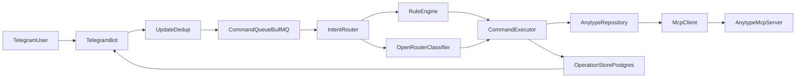

# Architecture

## High-level flow

## Слои

- `bot`: приём и отправка Telegram сообщений.
- `core/intent`: классификация и маршрутизация намерений.
- `core/execution`: выполнение бизнес-команд и формирование ответа.
- `adapters/anytype`: операции с Anytype через MCP tools.
- `adapters/mcp`: транспорт `stdio/http`, вызов MCP tools.
- `adapters/openrouter`: LLM-классификация (опционально).
- `adapters/db` + `prisma`: идемпотентность, статус операций, аудит.
- `adapters/queue`: асинхронная обработка и retries.

## Reliability decisions

- Idempotency ключ: `telegram.update_id` (таблица `ProcessedUpdate`).
- Статусы операций: `queued`, `processing`, `completed`, `failed`.
- Повтор MCP/LLM запросов: exponential backoff.
- Concurrency-safe обработка Telegram: `sequentialize` по `chat_id`.

## Граница MVP (важно)

- LLM в текущей версии работает как **intent classifier fallback**.
- MCP tools вызываются **детерминированным кодом сервиса**, а не моделью напрямую.
- Это означает:
  - понятные запросы обрабатываются без LLM;
  - LLM используется только для классификации неочевидных формулировок;
  - многошаговый tool-calling агент (как в Cursor) пока не включен и вынесен в roadmap.

## Security decisions

- allowlist по `user_id` и опционально `chat_id`.
- секреты только через ENV.
- редактирование чувствительных полей в логах.
- rule-first маршрутизация и fallback в Inbox при низкой уверенности LLM.
